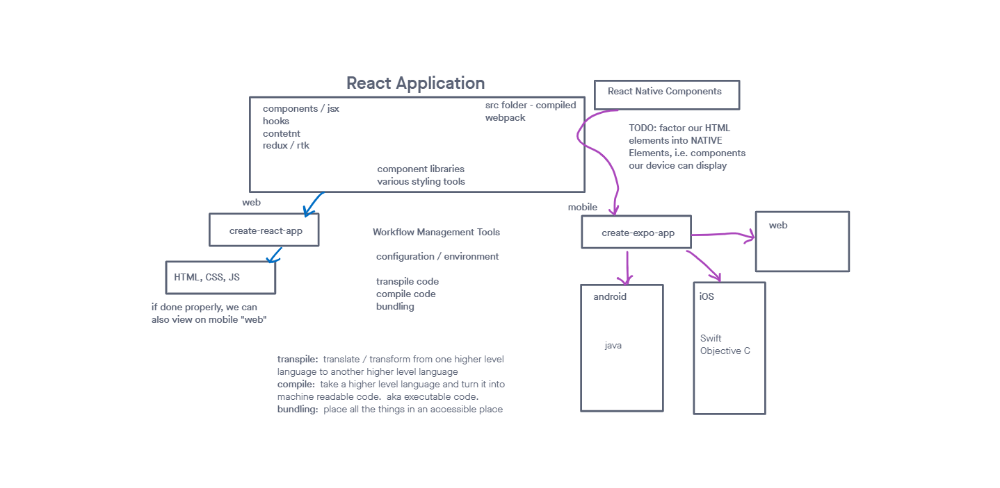

# Habit App

## Description

as my first foray into react native I decided to create a simple habit tracking app. It helps users set and track their daily habits, mark them as completed, and view progress in a calendar or streak format. The app also provides push notifications to remind users to complete their habits.

## Features

- Create and track habits
- View habits in calendar or streak format
- Receive push notifications to remind users to complete their habits

### installation

- Pre-requisites: Node.js, Expo CLI, Expo app on mobile device

1. Clone the repo
2. Install dependencies with `npm install`
3. Start the app with `npx expo start --tunnel'
4. Scan the QR code with the Expo app on your mobile device

### Built With

- React Native
- Expo
- Redux
- React Navigation
- React Native Calendars
- React Native Elements

### React Native UML

